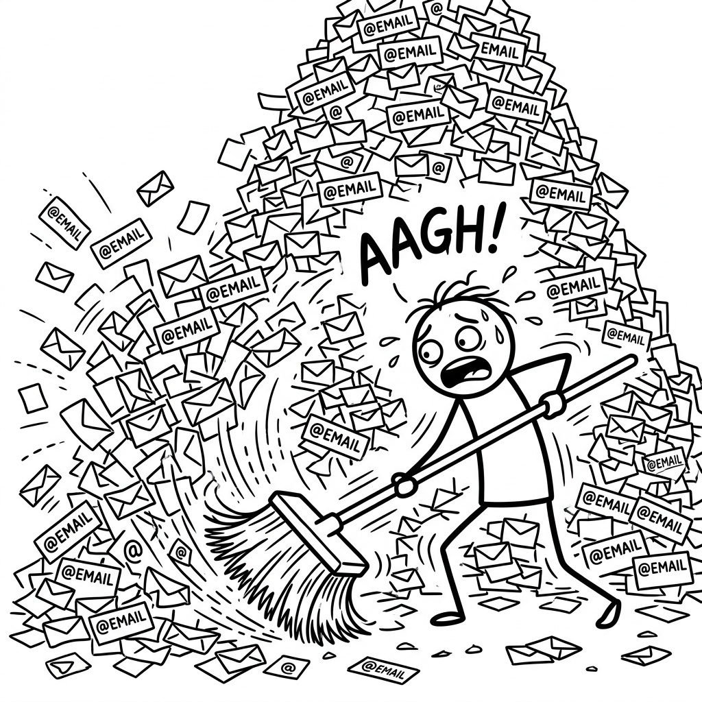

<p align="center">
  
</p>

<h1 align="center">Gmail Cleaner</h1>

<p align="center">
  <em>Because somewhere in those 50,000 emails is a tax document you actually need.</em>
</p>

<p align="center">
  <a href="https://pypi.org/project/gmail-cleaner/"></a>
  <a href="https://codecov.io/gh/immkg/gmail-cleaner"></a>
  <a href="https://github.com/immkg/gmail-cleaner/releases/latest"></a>
  
</p>

<p align="center">
  <strong>Built by Mayank Gupta</strong><br>
  <sub>Surgical precision for your inbox. ~99% less clutter &middot; ~100% more sanity &middot; 100% local.</sub>
</p>

---

You have 50,000 emails. Somewhere in that mountain of newsletters, random promotions, and auto-generated alerts is a critical message from your bank that you cannot afford to lose. You can't just 'Select All -> Delete'.

You need a surgical tool.

With Gmail Cleaner:

```bash
# It just deletes them.
python -m gmail_cleaner.main clean
```

Gmail Cleaner synchronizes your Gmail account into a local SQLite database, analyzes your emails using Pandas and Scikit-Learn, and interactively bulk-deletes the noise based on aggressive, local strategies.

## Before / after

You try to find an important bank email. Your search results are flooded with 400 "Limited Time Offer!" emails from a newsletter you never subscribed to. 

After Gmail Cleaner: You actually see your bank email.

## Setup

The most effort Gmail Cleaner will ever ask of you:

### 1. Enable the Gmail API
1. Go to the [Google Cloud Console](https://console.cloud.google.com/).
2. Create a new project or select an existing one.
3. Navigate to **APIs & Services > Library**.
4. Search for "Gmail API" and click **Enable**.

### 2. Set Up Desktop App Credentials
1. Go to **APIs & Services > OAuth consent screen**. Choose **External** and add your own Gmail address under **Test users**.
2. Go to **APIs & Services > Credentials**.
3. Click **Create Credentials** > **OAuth client ID**.
4. Choose **Desktop app**.
5. Click **Download JSON** on the confirmation dialog.
6. Rename the file to `credentials.json` and place it in the root folder.

### 3. Install
You can install directly from PyPI or download the standalone `.exe` from the latest GitHub Release.

```bash
pip install gmail-cleaner
```

## Configuration

Before running the clean command, open `gmail_cleaner/config.py` and customize your patterns:

- `AUTO_DELETE_EMAIL_PATTERNS`: Add email addresses or domains that you always want to delete instantly (e.g. `newsletter@spam.com`).
- `PROTECTED_EMAIL_PATTERNS`: Add personal or banking emails that should NEVER be deleted by the tool (e.g. `@yourbank.com`).

*Lazy, not negligent: The code ensures these patterns are scrubbed from version control, so you can safely keep this repo synced without leaking your personal contacts.*

## Commands

| Command | What it does |
|---------|--------------|
| `python -m gmail_cleaner.main sync` | Syncs your emails to a local SQLite database. |
| `python -m gmail_cleaner.main analyze` | Analyzes emails to show top domains, senders, and TF-IDF topic clusters. |
| `python -m gmail_cleaner.main clean` | Starts the interactive CLI to bulk delete emails based on strategies (newsletters, promotions, etc.). |
| `python -m gmail_cleaner.main clean --dry-run` | Simulates the deletion queue and prints what *would* be deleted without touching the Gmail API. |

*When cleaning, you can select specific email ranges (e.g., `1,2,5-10`, `k10` to keep the latest 10) and accumulate deletions before executing them in bulk by typing `yes` to skip or `now` to process the queue.*

## FAQ

**Does it upload my emails to a random server?**
No. It downloads them to a local SQLite database (`gmail.db`). The TF-IDF analysis, clustering, and deleting all happen entirely on your machine. 100% local.

**Will it accidentally delete my tax returns or bank statements?**
Not if you tell it not to. Add `@yourbank.com` or your accountant's email to `PROTECTED_EMAIL_PATTERNS` in `config.py`. Once there, it becomes structurally impossible for the tool to delete them, even if you explicitly select them.

**Can I undo a deletion?**
Yes. The tool moves emails to the Gmail Trash folder; it doesn't permanently annihilate them. You have 30 days to rescue them through the standard Gmail UI before Google purges them forever.

**What if I really need that shoe store newsletter from 2019?**
You don't. Insist anyway and you can use the `k` command (e.g., `k10`) to keep the latest 10 and delete the rest. But it will judge you silently.

## License

[MIT](LICENSE). The shortest license that works.
